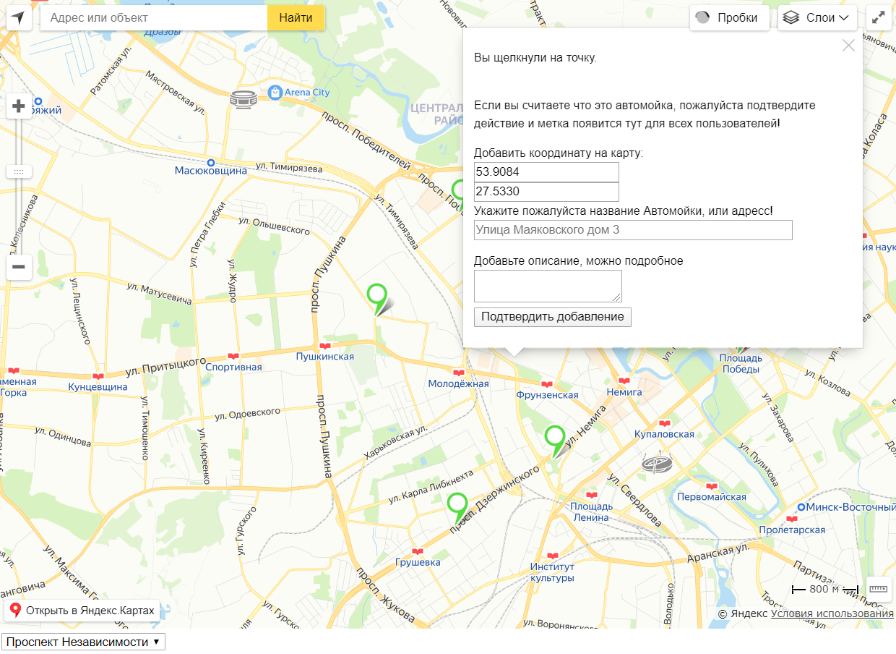
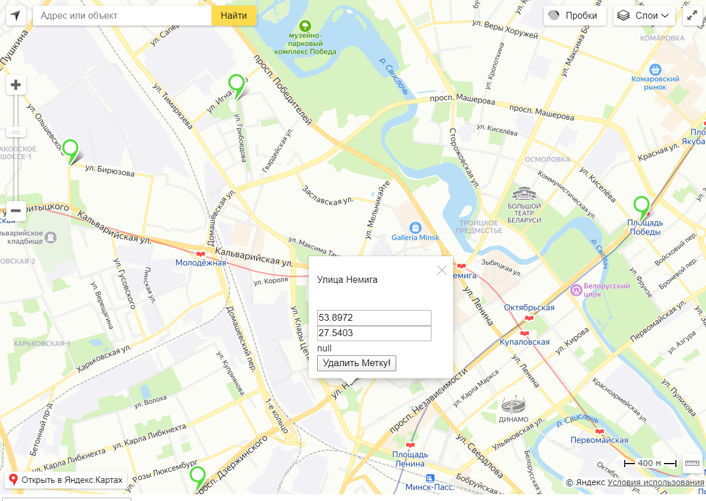

# yaMapsGeo Введение
Проект писался на yandex api library с использованием js, jquery на фронте .
И Node.js + Exress + PostgreSQL на бэке
Можно нажимать на метки и видеть данные районы с использованием List box
Можно добавлять новые метки и всё такое

## Back End и Front End
Файлы для фронт части расположены по пути components/layouts
Остальные файлы относятся к бэк части.
В проекте нет оригинального MVC как такового, потому что есть методики лучше этой. 
При построеннии архитектуры проекта опирался на https://temofeev.ru/info/articles/luchshie-praktiki-node-js-sovety-po-strukture-proektov/ методику. И вам советую, по ссылке так же объясняется почему так лучше.
## Запуск проекта
В корневой папке есть SQL Файл базы данных, называется pgsqldb.csv, необходимо ее импортировать в вашу PostgreSQL
По пути components/config/config.js вы найдете файл конфигурации, пропишите туда свои данные для связи с Базой Данных

## Сделали? - Запускайте!
npm start и вы готовы начинать.

## Скриншоты

